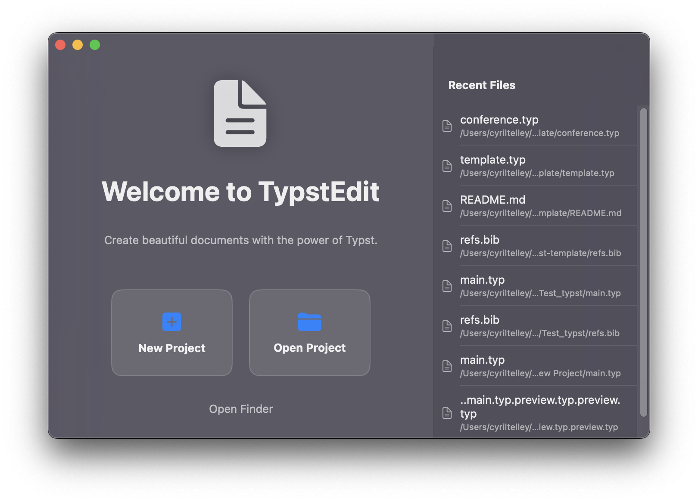
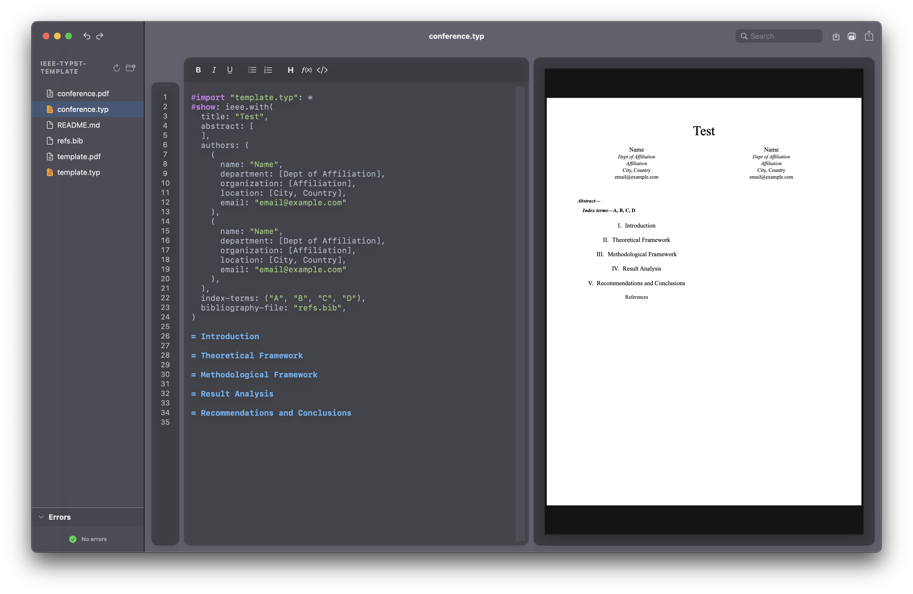

# TypstEdit

<p align="center">
  
</p>

<p align="center">
  <b>A lightweight, native macOS editor for Typst.</b>
</p>

<p align="center">
  <a href="#installation">Download</a> • 
  <a href="#features">Features</a> • 
  <a href="#building-from-source">Build</a>
</p>

---

**TypstEdit** is a native SwiftUI application designed to make writing [Typst](https://typst.app) documents on macOS seamless and efficient. It combines a robust text editor with a live preview, leveraging the speed of the native Typst CLI.




## ✨ Features

* **⚡️ Live Preview:** Real-time compilation and preview of your document as you type.
* **🚀 Project Templates:** Start quickly with built-in templates for **Articles, Reports, Presentations, and Resumes**.
* **🧩 Smart Snippets:** Quickly insert complex elements like **Tables, Charts, and Timelines** with one click.
* **🎨 Syntax Highlighting:** Native syntax highlighting for Typst code.
* **🍎 Native macOS Experience:** Built with SwiftUI. 100% Native, fast, and lightweight.
* **🐞 Error Reporting:** Integrated error panel to quickly spot compilation issues.
* **🔢 Line Numbers:** Helpful ruler for code navigation.
* **📁 Project Sidebar:** Easily navigate through your project files.
* **🌑 Dark Mode Optimized:** Designed for a comfortable, eye-friendly dark editing environment.

## 📥 Installation

TypstEdit is available for both **Apple Silicon** (M1/M2/M3) and **Intel** Macs.

1.  Go to the [Releases](../../releases) page.
2.  Download the correct installer for your Mac:
    * **Apple Silicon (M1/M2/M3):** Download `TypstEdit_AppleSilicon.dmg`
    * **Intel Macs:** Download `TypstEdit_Intel.dmg`
3.  Open the `.dmg` and drag the app to your **Applications** folder.
## 🛠️ Building from Source

If you want to contribute or build the app yourself:

### Prerequisites
* macOS 13.0+ (Ventura) or later.
* Xcode 15+ installed.
* Swift 5.9+.

### Steps

1.  **Clone the repository:**
    ```bash
    git clone [https://github.com/votre-nom-utilisateur/TypstEdit.git](https://github.com/votre-nom-utilisateur/TypstEdit.git)
    cd TypstEdit
    ```

2.  **Ensure the Typst binary is present:**
    The app requires the `typst` binary. Place the appropriate binary for your architecture in `TypstEdit/typst-aarch64-apple-darwin/typst` (or allow the script to handle it if configured).

3.  **Bundle and Build:**
    Use the included script to compile and create the bundle:
    ```bash
    chmod +x bundle.sh
    ./bundle.sh
    ```

4.  **Create Installer (Optional):**
    To generate the `.dmg` file:
    ```bash
    chmod +x create_dmg.sh
    ./create_dmg.sh
    ```
### ⚠️ "App is damaged" Error

Since this app is open-source and not signed with a paid Apple Developer ID, macOS Gatekeeper might show a message saying **"TypstEdit is damaged and can't be opened"** on the first launch.

**To fix this (you only need to do it once):**

1. Open your **Terminal** app.
2. Paste the following command and press Enter:
   ```bash
   xattr -cr /Applications/TypstEdit.app
3. You can now open the app normally!


## 📄 License

This project is open source. 

MIT License

Copyright (c) 2024 SuperMegaFort

Permission is hereby granted, free of charge, to any person obtaining a copy
of this software and associated documentation files (the "Software"), to deal
in the Software without restriction, including without limitation the rights
to use, copy, modify, merge, publish, distribute, sublicense, and/or sell
copies of the Software, and to permit persons to whom the Software is
furnished to do so, subject to the following conditions:

The above copyright notice and this permission notice shall be included in all
copies or substantial portions of the Software.

THE SOFTWARE IS PROVIDED "AS IS", WITHOUT WARRANTY OF ANY KIND, EXPRESS OR
IMPLIED, INCLUDING BUT NOT LIMITED TO THE WARRANTIES OF MERCHANTABILITY,
FITNESS FOR A PARTICULAR PURPOSE AND NONINFRINGEMENT. IN NO EVENT SHALL THE
AUTHORS OR COPYRIGHT HOLDERS BE LIABLE FOR ANY CLAIM, DAMAGES OR OTHER
LIABILITY, WHETHER IN AN ACTION OF CONTRACT, TORT OR OTHERWISE, ARISING FROM,
OUT OF OR IN CONNECTION WITH THE SOFTWARE OR THE USE OR OTHER DEALINGS IN THE
SOFTWARE.

## ❤️ Credits

* Built for [Typst](https://typst.app).
* Uses the official Typst CLI binary.
